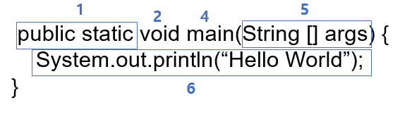

# 자바 프로그래밍 시험

## 자바의 기본 자료형의 표현범위, 접미사


정수형 : byte, char, short, int ,long  
실수형 : float, double  
논리형 : boolean

### 표현범위

| 타입  | 최소                   | 최대                   |
| ----- | ---------------------- | ---------------------- |
| byte  | -128 (-2^7)            | 127 (2^7-1)            |
| short | -32768 (-2^15)         | 32767 (2^15-1)         |
| int   | -2,147,483,648 (-2^31) | 2,147,483,647 (2^31-1) |
| long  | -2^63                  | 2^63-1                 |
| char  | 0                      | 65535 (2^16-1)         |

### 접미사

자바는 기본적으로 숫자를 명시하면 int로 생각한다  
하지만 int의 최대 값을 넘는1000000000000을 넣으면 컴파일 에러가 발생한다  
이러한 이유로 long을 쓸때는 숫자뒤에 `L`을 붙여야 한다

```java
long a = 1000000000000L;
```

소수를 지정할 때 기본이 double이기 때문에
float를 쓸 때는 숫자뒤에 `F`를 븉여야 한다

```java
float a = 3.14F;
```

## printf 문 출력지시자

- `%b`: 불리언(boolean) 형식으로 출력
- `%d`: 10진수 (deciaml) 정수의 형식으로 출력
- `%o`: 8진수 (octal) 정수의 형식으로 출력
- `%x, %X`: 16진수 (hexa-decimal) 정수의 형식으로 출력
- `%f`: 부동 소수점(floating-point)의 형식으로 출력
- `%e, %E`: 지수(exponent) 표현식의 형식으로 출력
- `%c`: 문자(character)로 출력
- `%s`: 문자열(string)로 출력

## 자바의 콘솔 사용자 입력

- ### InputStream
  ```java
  InputStream in = System.in;
  ```
  1byte 씩 입력 받는다
- ### InputStreamReader
  ```java
  InputStreamReader reader = new InputStreamReader(in);
  ```
  char[]로 입력받는다
- ### BufferedReader
      ```java
      BufferedReader br = new BufferedReader(reader);
      ```
  String으로 입력받는다
- ### Scanner
  ```java
  Scanner sc = new Scanner(System.in);
  ```

## 자바의 연산자

- ### 산술연산
  `+`, `-`, `*`, `/`, `%`
- ### 대입연산
  `=`, `+=`, `-=`, `*=`, `/=`, `%=`, `&=`, `|=`, `^=`, `<<=`, `>>=`, `>>>=`
- ### 증감연산
  `++`, `--`
- ### 비교연산
  `==`, `!=`, `>`, `>=`, `<`, `<=`
- ### 비트연산
  `&&`, `||`, `!`
- ### 논리연산
  `&`: 대응되는 비트가 모두 1이면 1을 반환함. (비트 AND 연산)  
   `|`: 대응되는 비트 중에서 하나라도 1이면 1을 반환함. (비트 OR 연산)  
   `^`: 대응되는 비트가 서로 다르면 1을 반환함. (비트 XOR 연산)  
   `~`: 비트를 1이면 0으로, 0이면 1로 반전시킴. (비트 NOT 연산, 1의 보수)  
   `<<`: 명시된 수만큼 비트들을 전부 왼쪽으로 이동시킴. (left shift 연산)  
   `>>`: 부호를 유지하면서 지정한 수만큼 비트를 전부 오른쪽으로 이동시킴. (right shift 연산)  
   `>>>`: 지정한 수만큼 비트를 전부 오른쪽으로 이동시키며, 새로운 비트는 전부 0이 됨
- ### 삼항연산자
  `조건식 ? 참일때 반환 값 : 거짓일때 반환 값`

## 연산자 우선순위


## 자바의 컴파일 과정

#### 소스코드 작성 -> 소스코드.java 컴파일 -> 컴파일러에서 소스코드.class(바이너리 파일)로 변환 -> JVM에서 읽음 -> OS에서 실행 -> 실행결과

## 클래스와 객체, 메소드, 매개변수, return타입, 이름 명명 작성 관례

### 클래스

클래스 이름은 명사이여야 하며, 복합 단어일 경우 각 단어의 첫 글자는 대문자이어야 한다  
클래스 이름은 간단하고 명시적으로 작성해야 한다  
완전한 단어를 사용하고 두 문자어와 약어는 피하도록 한다  
Ex)

```java
class Car;
class OpertorComparision;
```

### 메소드

메소드 이름은 카멜케이스를 사용해야하며 첫글자는 소문자여야 한다  
메소드는 동사 단어여야 한다

```java
getName();
```

### 메소드의 구조



1. 제어자 : 메소드의 특성을 정의하는 부분
2. 리턴타입 : 메소드가 끝났을때 돌려주는 타입
3. 메소드 이름 : 소괄호 앞에있는 메소드 이름
4. 매개 변수 목록 : 소괄호 앞에있는 메개 변수의 목록
5. 메소드 내용 : 중괄호 안에 있는 내용들

### 변수

- 길이의 제한은 없다
- 첫 문자는 유니코드 문자 , 알파벳, $, _ 만 올수 있지만 일반적으로 $ _ 로 시작하지 않는다
- 두번쨰 문자부터는 유니코드 문자 , 알파벳, $, \_ 중 아무거나 사용가능
- 첫 단어는 소문자 두번째 단어부터는 첫 문자의 대문자로 시작
- 상수는 모두 대문자로 지정하며 단어사이는 \_ 로 구분한다

## 기본 생성자, 생성자 작성규칙, 객체의 생성 방법

### 기본 생성자

자바의 모든 클래스에는 하나 이상의 생성자가 정의되어 있어야 한다  
하지만 특별히 생성자를 정의하지 않고도 인스턴스를 생성가능하다  
이것은 자바 컴파일러가 기본 생성자를 제공해주기 때문이다  
기본생성자는 매개변수를 가지지 않는고 아무런 명령어도 포함하지 않는다

컴파일시 클래스에 생성자가 없다면 자동으로 기본생성자를 추가한다

```java
클래스이름(){}
```

Ex )

```java
public class Car {
    public static void main(String[] args) {
        Car myCar = new Car();                // 기본 생성자의 호출
    }
}
```

만약 클래스 내에 생성자가 있다면 기본생성자는 생성되지 않는다

### 생성자 작성규칙

선언부에 리턴타입이 없고
클래스이름과 동일하게 이름을 지정해야한다

생성자 위치는 인스턴수변수과 메소드 영역 사이가 좋다

```java
public class ReferenceString {
    String instanceVariable; -> 인스턴스 변수

    //생성자 영역
    public ReferenceString() {}
    public ReferenceString(String arg) {}

   //메소드 영역
    public static void main(String args[]) {
    	ReferenceString reference = new ReferenceString();
    }

    public String getString() {
    	return instanceVariable;
    }
    public void setString() {
    	instanceVariable = str;
    }

}
```

### 객체의 생성방법

```
Class이름 변수명 = new 생성자();
```

이처럼 클래스 명에 new를 붙여 객체를 생성한다  
Ex)

```java
class HelloWorld {
   public static void main(String[] args) {
       HelloWorld helloWorld = new HelloWorld();
   }
}
```

## 하나의 클래스에 여러 생성자 생성방법

매개변수를 다르게 하여 생성자를 여러개 만들 수 있다

```java
public class MemberDto(){
    public string name;
    public String phone;
    public String email;

    public MemberDto(String name){
        this.name = name;
    }

     public MemberDto(String name,String phone){
        this.name = name;
        this.phone = phone;
    }
}
```

## 클래스변수, 객체변수, 지역변수, 매개변수, final로 선언된 변수, Static으로 선언된 변수

```java
public class VariableTypesKor{
    int a; //인스턴스 변수
    static int b;//클래스 변수
    public void method(int 매개변수){
        int c; //지역변수
    }
}
```

- 지역변수 : 지역변수를 선언한 중괄호 내에서만 유효
- 매개변수 : 메소드가 호출될때 생명시작, 그 객체를 참조하고 있는 다른객체가 없으면 소멸
- 인스턴스 변수 : 객체가 생성될 때 생명이 시작, 그 객체를 참조하고 있는 다른객체가 없으면 소멸
- 클래스변수 : 클래스가 처음 호출될 때 생명이 시작, 자바 프로그램이 끝날때 소멸

### final로 선언된 변수

변수에 final을 붙이면 이 변수는 수정할 수 없다는 의미

### static로 선언된 변수

static으로 선언된 변수는 Heap 영역에 생성된다  
Heap 영역은 가비지 컬렉터가 관리하지 않기때문에 프로그램이 종료될때까지 할당된채로 존재한다  
객체의 성성없이 바로 접근할 수 있다  
메모리에 한번 할당되므로 여러 객체가 해당 메모리를 공유하게 된다

## 정수형 자료의 오버플로 시 값

최댓값 + 1 = 최솟값
최솟값 - 1 = 최댓값

## 접근제한자


## Object 클래스

모든 클래스는 Object (java.lang.Object) 클래스의 상속을 받는다

> 어떻게 알수 있을까?  
> 클래스를 만들고 메소드를 선언하지않아도 toString()등 메서드를 호출할 수 있다 이것을 보고 Object 클래스를 상속받는다는 것을 알 수 있다

그럼 굳이 왜 Object 클래스의 상속을 받을까?

> Object클래스에 있는 메소드들을 통해 기본적인 행동을 정의할 수 있기 때문에 상속을 받는

### Object 클래스에서 제공하는 메소드들의 종류

#### 객체를 위한 메소드

`protected Object clone()` : 객체의 복사본을 만들어 리턴한다  
`public boolean equals(Object obj)` : 현재 객체와 매개변수로 넘겨받은 객체가 같은지 확인, 같으면 ture 다르면 false  
`protected void finalize()` : 현재 객체가 더 이상 쓸모 없어졌을 때 가비지 컬렉터에 의해 이 메소드가 호출  
`public Class<?> getClass()` : 현재객체의 Class 객체를 리턴  
`public int hashCode()` : 객체에 대한 해시코드값을 리턴 해시 코드라는 것은 16진수로 제공되는 객체의 메모리 주소를 말한다

#### 쓰레드 처리를 위한 메소드

`public void notify()` : 이 모니터에 대기하고있는 단일 쓰레드를 깨운다
`public void notifyAll()` : 이 객체의 모니터에 대기하고 있는 모든 쓰레드를 꺠운다
`public void wait()` : 다른 쓰레드가 현재 객체에 대한 notify() 메소드나 notifyAll() 메소드를 호출할 때까지 현재 쓰레드가 대기하고 있도록 한다  
`public void wait(long timeout)` : wait()메소드와 동일기능 매개변수에 지정한 시간만큼 대기  
`public void wait(long timeout,int nanos)` : wait() 메소드와 동일기능
